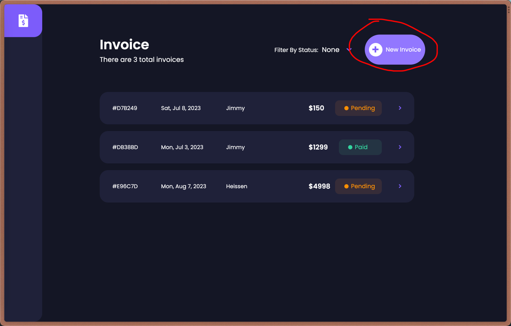
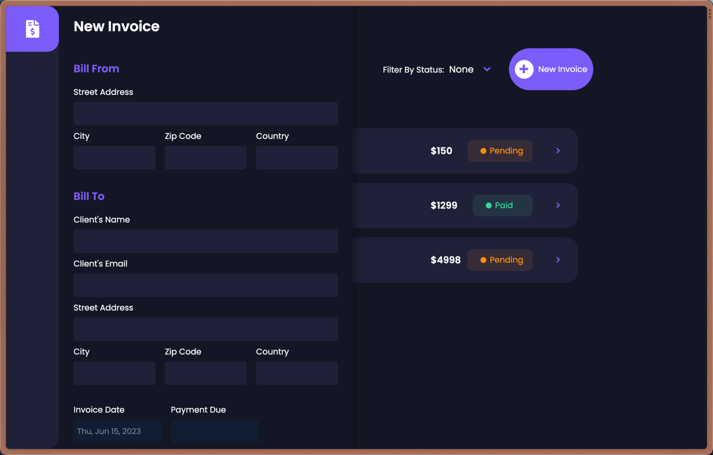
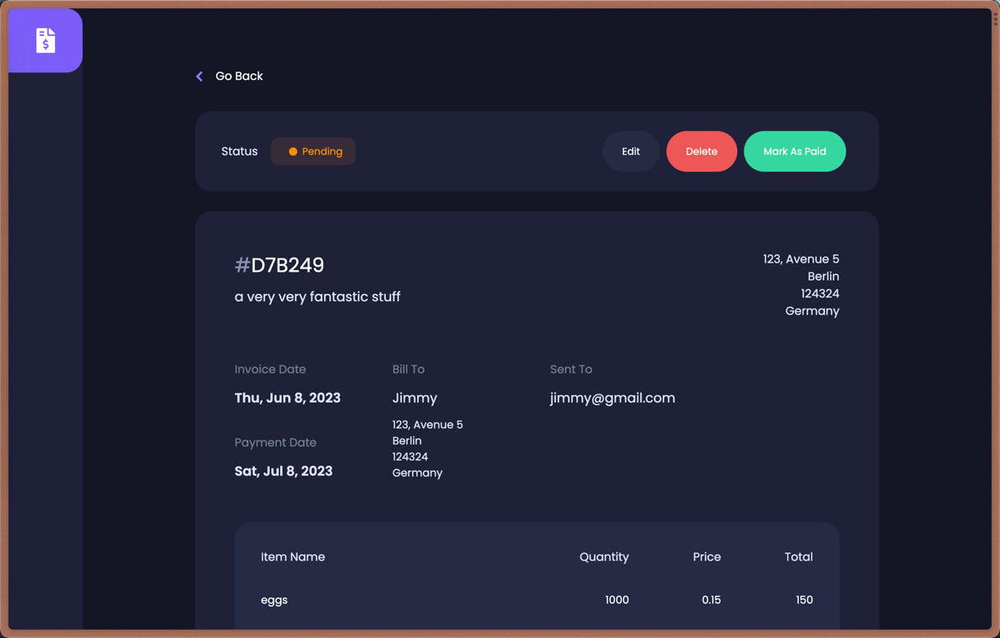
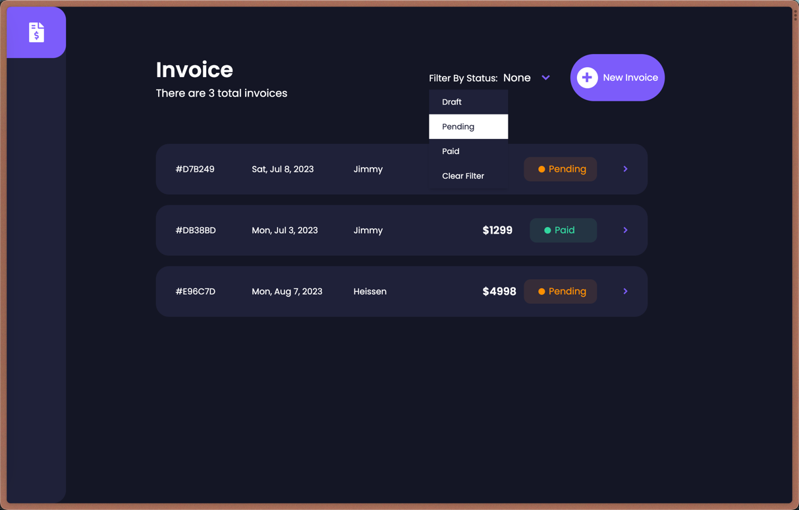
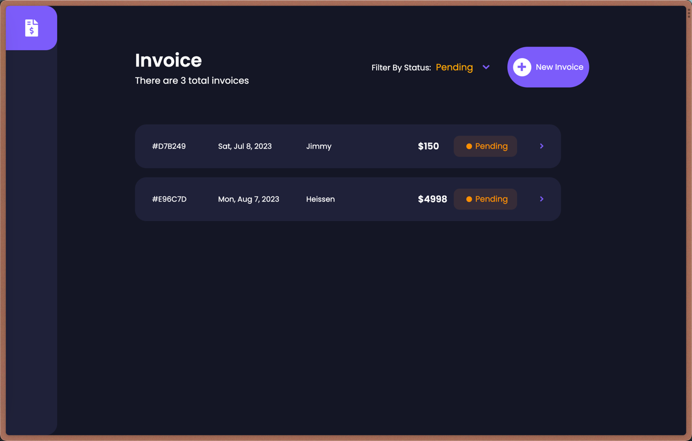

# Invoice-App

## Description
This web app is just for studying and may have some bugs.
I use Vue.js and Vuex to build this app and firebase to store
the invoice data.

## Project Demo

### create a new invoice
click the "New Invoice" button to create a new invoice


and you will see a sidebar like this.

then you can fill those blanks and save or upload the invoice.

### edit an invoice
you can click any invoice in the Home view
and an invoice view will show up.

you can edit it at your will or just discard it.

### filter invoices
you can click the filter button to display
invoices of a specific status.




## Project setup
install the dependencies
```
npm install
```

run the app
```
npm run serve
```

